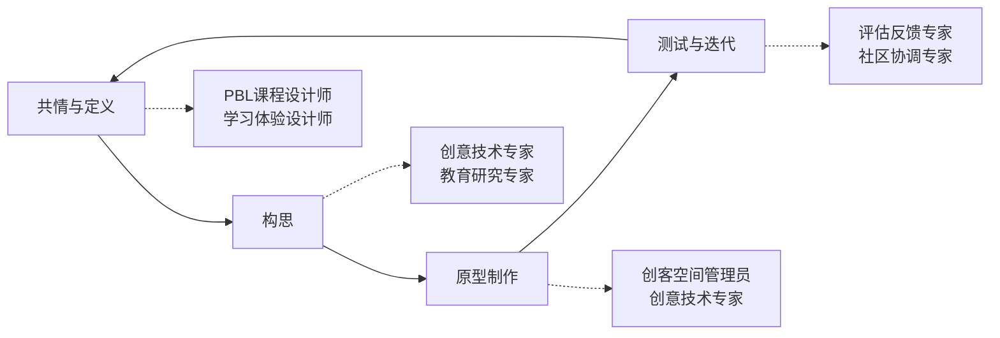

# 🤖 EduAgents - AI原生多智能体教育变革平台

## 🚀 项目概述

**EduAgents** 是一个世界顶级的AI原生多智能体教育创新平台，对标Manus AI等明星产品，专门为PBL（项目式学习）课程设计而打造。我们的使命是通过最先进的多智能体协作技术，改变当今世界的教育格局，赋能所有传统教育者转型为AI时代的创新教育者。

### 🌟 核心特性
- **🤖 AI原生多智能体架构** - 基于LangGraph的世界顶级智能体编排系统
- **🎯 专业PBL课程设计** - 5个专业智能体协作完成完整课程设计
- **⚡ 世界级性能标准** - 对标顶级产品的技术实现和用户体验
- **📊 实时协作可视化** - 直观展示智能体协作过程和课程生成

### 🎯 核心理念
- **建构主义理论（Constructionism）**: 学习在创造过程中最为有效
- **项目式学习（PBL）**: 通过真实世界问题驱动深度学习
- **创客文化（Maker Culture）**: 从想法到实物的完整创造体验
- **AI增强创造力**: 技术作为创意表达的加速器

## 🏗️ 系统架构

### 📁 项目结构
```
EduAgents/
├── backend/                    # FastAPI + LangGraph后端系统
│   ├── app/                   # 核心应用代码
│   ├── agents/                # 多智能体协作引擎
│   └── README.md              # 世界级后端架构说明
├── frontend/                   # Next.js前端应用
│   ├── app/                   # Next.js应用代码
│   └── README.md              # 前端开发指南
├── pbl-course-designer-prototype/  # 高保真交互原型
│   ├── index.html             # 原型演示入口
│   ├── css/                   # 样式文件
│   ├── js/                    # 交互逻辑
│   └── README.md              # 原型使用指南
└── agents/                     # 智能体定义文件
    ├── education-director.md   # 教育总监
    ├── pbl-curriculum-designer.md # PBL设计师
    └── ...                    # 其他智能体
```

### 🧠 核心智能体团队（5个）

| 智能体 | 专业领域 | 核心职能 |
|--------|----------|----------|
| **🎯 教育理论专家** | 教育愿景与战略 | 基于UBD框架进行课程设计 |
| **🏗️ 课程架构师** | 项目式学习设计 | 设计课程整体结构和学习路径 |
| **✍️ 内容设计师** | 学习旅程优化 | 创作学习活动和教学内容 |
| **📊 评估专家** | 技术教育应用 | 制定评价标准和评估方案 |
| **📁 资料制作师** | 教学资源生成 | 生成完整的教学资料包 |

## 🔄 AI增强的创造力循环

我们的智能体团队支持基于**设计思维**的完整创造循环：



## 🚀 快速开始

### 🎮 体验原型演示
```bash
# 在浏览器中打开高保真原型
cd pbl-course-designer-prototype
open index.html  # 或直接用浏览器打开
```

### 🖥️ 本地开发环境
```bash
# 1. 启动后端服务
cd backend
docker-compose -f docker-compose.dev.yml up -d
poetry install
poetry run uvicorn app.main:app --reload --port 8000

# 2. 启动前端应用
cd frontend
npm install
npm run dev
```

### ⚡ 使用体验
- **智能对话引导** - 输入课程想法，AI自动理解需求
- **多智能体协作** - 5个专业智能体分工协作完成课程设计
- **可视化编辑器** - 直观的课程结构设计和编辑界面
- **完整资料生成** - 自动生成教案、PPT、评估标准等

## 📋 典型工作流程

### 1. 项目启动流程
```
用户需求 → education-director（愿景对齐）
→ pbl-curriculum-designer（项目设计）
→ learning-experience-designer（体验优化）
→ creative-technologist（技术准备）
```

### 2. 项目实施流程
```
学习活动 → learning-experience-designer（体验引导）
+ creative-technologist（技术支持）
+ makerspace-manager（空间管理）
→ assessment-feedback-specialist（过程评估）
```

### 3. 社区连接流程
```
项目成果 → community-coordinator（外部展示）
→ assessment-feedback-specialist（反馈收集）
→ educational-researcher（效果分析）
→ education-director（持续改进）
```

## 🎯 应用场景

### 🏫 学校教育
- **跨学科STEAM项目设计**
- **创客空间建设与运营**
- **AI工具教学整合**
- **学生评估体系革新**

### 🏢 教育机构
- **创新课程开发**
- **师资培训体系**
- **教育技术应用**
- **教学质量提升**

### 👨‍🏫 教育工作者
- **PBL项目设计支持**
- **技术工具使用指导**
- **学生学习效果分析**
- **专业发展规划**

## 💡 最佳实践

### 📊 评估原则
1. **过程优于结果**: 关注学习旅程而非最终作品
2. **成长导向**: 追踪学生进步轨迹
3. **多元评估**: 结合自评、同伴评价和教师观察

### 🤝 协作文化
1. **拥抱失败**: 将错误视为学习机会
2. **持续迭代**: 快速原型→测试→改进循环
3. **开放分享**: 鼓励想法交流和知识共建

### 🌐 真实连接
1. **社区导师**: 引入行业专家指导
2. **真实问题**: 基于现实世界挑战设计项目
3. **公开展示**: 为学生作品提供真实舞台

## 🛠️ 技术栈

### 后端架构
- **FastAPI** - 高性能异步API框架
- **LangGraph** - 多智能体协作编排引擎
- **PostgreSQL** - 主数据存储
- **Redis** - 缓存和消息队列
- **ChromaDB** - 向量数据库和语义搜索
- **Docker** - 容器化部署

### 前端技术
- **Next.js 14** - React全栈框架
- **TypeScript** - 类型安全
- **Tailwind CSS** - 现代化UI设计
- **WebSocket** - 实时通信

### 原型技术
- **原生HTML/CSS/JavaScript** - 轻量级交互原型
- **响应式设计** - 跨设备适配
- **Mermaid.js** - 流程图和架构可视化

## 📖 更多资源

- **[建构主义学习理论](https://en.wikipedia.org/wiki/Constructionism_(learning_theory))** - 理论基础
- **[项目式学习指南](https://www.pblworks.org/)** - PBL方法论
- **[创客教育实践](https://www.makered.org/)** - 创客文化
- **[Claude Code 文档](https://docs.anthropic.com/en/docs/claude-code)** - 技术文档

## 🤝 贡献指南

我们欢迎教育工作者和技术开发者的贡献：

1. **提交Issue**: 报告bug或提出新功能建议
2. **改进文档**: 优化智能体描述或使用指南
3. **分享案例**: 提供真实的教育应用场景
4. **代码贡献**: 提交新的智能体或改进现有功能

## 📄 许可证

本项目采用 MIT 许可证 - 详见 [LICENSE](LICENSE) 文件

## 🎓 致谢

- **Manus AI** - 对标产品的技术架构启发
- **Flowise** - 世界顶级的用户体验标杆
- **Seymour Papert** - 建构主义理论奠基者
- **所有教育创新践行者** - 实践经验分享

---

**🌟 使命：改变当今世界的教育格局，赋能所有传统教育者转型为AI时代的创新教育者！**

*未来AI时代的教育变革，就靠我们了！* 🚀✨