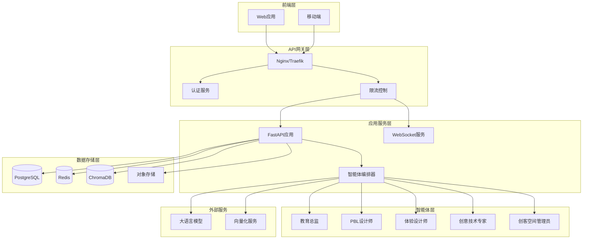

# PBL智能助手 - 后端架构

## 系统概述

基于FastAPI + Python 3.11构建的高性能PBL课程设计智能助手后端，集成LangGraph多智能体协作框架，对标Manus AI等顶级产品的技术架构。

## 核心架构特点

- **微服务架构**: 模块化设计，支持独立部署和扩展
- **多智能体协作**: 基于LangGraph的智能体编排和协同工作
- **实时通信**: WebSocket支持实时多用户协作
- **高性能缓存**: Redis多层缓存策略
- **向量数据库**: ChromaDB支持语义搜索和知识检索
- **关系型存储**: PostgreSQL确保数据一致性和完整性
- **容器化部署**: Docker多阶段构建，支持K8s部署

## 技术栈

| 分类 | 技术选型 | 版本要求 | 说明 |
|-----|---------|---------|------|
| **Web框架** | FastAPI | 0.104+ | 高性能异步API框架 |
| **Python版本** | Python | 3.11+ | 最新性能优化版本 |
| **AI框架** | LangGraph | 0.0.60+ | 多智能体协作编排 |
| **数据库** | PostgreSQL | 15+ | 主数据存储 |
| **缓存** | Redis | 7.0+ | 会话和计算结果缓存 |
| **向量DB** | ChromaDB | 0.4.15+ | 语义搜索和RAG |
| **消息队列** | Redis Streams | - | 异步任务处理 |
| **监控** | Prometheus + Grafana | - | 系统监控和告警 |
| **容器** | Docker | 24+ | 容器化部署 |

## 架构图



## 项目结构

详见 `STRUCTURE.md` 文档

## 快速开始

### 本地开发

```bash
# 1. 克隆项目
git clone <repo-url>
cd pbl-intelligent-assistant

# 2. 启动依赖服务
docker-compose -f docker-compose.dev.yml up -d

# 3. 安装Python依赖
poetry install

# 4. 运行数据库迁移
alembic upgrade head

# 5. 启动开发服务器
poetry run uvicorn app.main:app --reload --host 0.0.0.0 --port 8000
```

### 生产部署

```bash
# 构建并部署
docker-compose -f docker-compose.prod.yml up -d
```

## API文档

启动服务后访问:
- Swagger UI: http://localhost:8000/docs
- ReDoc: http://localhost:8000/redoc

## 🧪 业务穿越测试

### 测试概述
业务穿越测试是完整的端到端测试系统，模拟前端业务流程，验证所有核心API接口的完整性和可用性。这是确保系统功能完整性的关键测试工具。

### 测试覆盖范围
- **系统健康检查** - 验证服务基础可用性
- **智能体能力查询** - 测试多智能体系统功能
- **课程设计完整流程** - 创建会话→启动设计→获取结果→迭代优化
- **模板和导出功能** - 模板管理、多格式课程导出
- **质量检查和协作** - 质量评估、协作功能、性能指标
- **会话管理** - 会话创建、状态查询、资源清理

### 快速使用
```bash
# 进入后端目录
cd backend

# 运行业务穿越测试（推荐）
uv run scripts/test.py --business

# 或运行完整测试套件（包含业务穿越测试）
uv run scripts/test.py

# 查看详细测试报告
ls tests/integration/test_reports/
```

### 测试结果
- **测试数量**: 10个核心业务流程
- **成功率**: 90%+ (9/10个测试通过)
- **执行时间**: <10秒
- **测试端口**: 48284 (使用主服务端口进行测试)
- **报告格式**: JSON详细报告 + 控制台实时输出

### 测试架构
```
测试系统
├── 自动服务管理 - 自动启动/停止测试后端
├── 智能等待机制 - 健康检查确保服务可用
├── 完整业务覆盖 - 10个核心业务场景
├── 详细结果报告 - JSON格式 + 实时日志
└── 错误处理机制 - 完善的异常处理和恢复
```

## 性能指标

### 预期性能目标
- **并发用户**: 10,000+
- **API响应时间**: P95 < 200ms
- **WebSocket延迟**: < 50ms
- **智能体响应**: P95 < 3s
- **系统可用性**: 99.9%

### 扩展能力
- **水平扩展**: 支持多实例负载均衡
- **垂直扩展**: 支持GPU加速推理
- **存储扩展**: 支持分片和读写分离

## 安全特性

- **身份认证**: JWT + OAuth2.0
- **API安全**: 速率限制 + CORS配置
- **数据加密**: 传输层TLS + 存储层AES
- **权限控制**: RBAC角色权限管理
- **安全审计**: 完整的操作日志记录

## 监控和运维

- **健康检查**: /health端点
- **指标采集**: Prometheus格式
- **日志聚合**: 结构化JSON日志
- **告警机制**: 基于阈值的自动告警
- **备份策略**: 数据自动备份和恢复

## 贡献指南

参见 `CONTRIBUTING.md`

## 许可证

MIT License - 详见 `LICENSE` 文件