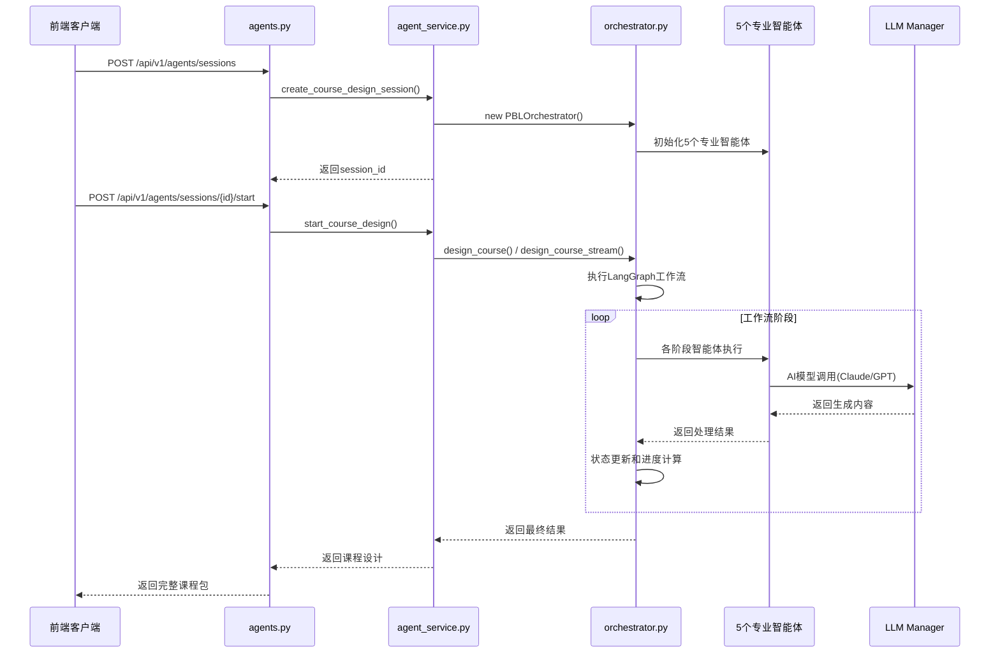

# 🎯 智能体课程设计核心流程完整调用链分析

## 📋 概述

本文档深入分析EduAgents系统中最核心的功能——智能体协作进行PBL课程设计的完整调用链。从API入口到AI模型调用，详细阐述每一层的执行逻辑和关键代码路径。

## 🔍 完整调用序列图



## 📁 核心文件架构

### 业务穿越测试调用的核心API

| 测试序号 | 测试名称 | API端点 | 对应文件路径 |
|---------|---------|---------|-------------|
| 1 | **基础连通性测试** | `GET /` | `backend/app/main.py:77` |
| 2 | **系统能力查询** | `GET /api/v1/agents/capabilities` | `backend/app/api/v1/agents.py:539` |
| 3 | **模板功能测试** | `GET /api/v1/templates/*` | `backend/app/api/v1/templates.py` |
| 4 | **课程设计会话流程** | `POST /api/v1/agents/sessions` | `backend/app/api/v1/agents.py:123` |
| 5 | **课程迭代优化流程** | `POST /api/v1/agents/sessions/{id}/iterate` | `backend/app/api/v1/agents.py:252` |
| 6 | **课程导出功能** | `GET /api/v1/agents/sessions/{id}/export` | `backend/app/api/v1/agents.py:281` |
| 7 | **质量检查功能** | `GET /api/v1/quality/*` | `backend/app/api/v1/quality.py` |
| 8 | **协作功能测试** | `GET /api/v1/collaboration/*` | `backend/app/api/v1/collaboration.py` |
| 9 | **智能体性能指标** | `GET /api/v1/agents/metrics` | `backend/app/api/v1/agents.py:325` |
| 10 | **会话清理** | `DELETE /api/v1/agents/sessions/{id}` | `backend/app/api/v1/agents.py:352` |

## 🔗 五层调用链详细分析

### 第一层：API入口层
**文件**: `backend/app/api/v1/agents.py`

#### 关键端点

**1. 会话创建**
```python
@router.post("/sessions", response_model=Dict[str, Any])
async def create_design_session(
    request: CreateSessionRequest,
    background_tasks: BackgroundTasks,
    current_user: Dict = Depends(get_current_user),
) -> Dict[str, Any]:  # line 123-128
```

**核心逻辑**:
```python
# 转换请求数据
requirements = request.requirements.dict()
config = request.config.dict() if request.config else None

# 调用服务层创建会话
session = await agent_service.create_course_design_session(
    requirements=requirements, mode=request.mode, config=config
)  # line 144-146
```

**2. 设计流程启动**
```python
@router.post("/sessions/{session_id}/start")
async def start_design_process(
    session_id: str,
    stream: bool = Query(default=False, description="Enable streaming response"),
    current_user: Dict = Depends(get_current_user),
):  # line 162-167
```

**核心逻辑**:
```python
if stream:
    # 流式响应
    async def generate():
        async for update in agent_service.start_course_design(
            session_id, stream=True
        ):
            yield f"data: {json.dumps(update)}\n\n"  # line 178-181

    return StreamingResponse(generate(), media_type="text/event-stream")
else:
    # 完整结果
    result = await agent_service.start_course_design(session_id, stream=False)
    return {"success": True, "data": result}  # line 195-199
```

### 第二层：服务层
**文件**: `backend/app/services/agent_service.py`

#### 关键方法

**1. 会话创建**
```python
async def create_course_design_session(
    self,
    requirements: Dict[str, Any],
    mode: str = "full_course",
    config: Optional[Dict[str, Any]] = None,
) -> Dict[str, Any]:  # line 29-34
```

**核心逻辑**:
```python
# 验证需求
self._validate_requirements(requirements)

# 创建会话ID
session_id = str(uuid4())

# 确定编排器模式
orchestrator_mode = OrchestratorMode[mode.upper()]

# 创建编排器
orchestrator = PBLOrchestrator(
    llm_manager=self.llm_manager,
    mode=orchestrator_mode,
    enable_streaming=config.get("streaming", True) if config else True,
    max_iterations=config.get("max_iterations", 3) if config else 3,
)  # line 57-62

# 存储编排器和会话
self.orchestrators[session_id] = orchestrator
self.sessions[session_id] = {
    "id": session_id,
    "requirements": requirements,
    "mode": mode,
    "status": "created",
    "created_at": datetime.utcnow(),
}  # line 65-75
```

**2. 设计流程启动**
```python
async def start_course_design(
    self, session_id: str, stream: bool = False
):  # line 84-86
```

**核心逻辑**:
```python
# 获取会话和编排器
session = self.sessions[session_id]
orchestrator = self.orchestrators[session_id]

# 更新会话状态
session["status"] = "running"
session["started_at"] = datetime.utcnow()

if stream:
    # 流式处理
    async for update in orchestrator.design_course(
        session["requirements"], session["config"]
    ):
        # 更新会话进度
        session["progress"] = update.get("progress", 0)
        session["current_phase"] = update.get("phase")

        yield {
            "session_id": session_id,
            "type": update.get("type"),
            "phase": update.get("phase"),
            "progress": update.get("progress"),
            "data": update.get("data"),
            "timestamp": datetime.utcnow().isoformat(),
        }  # line 112-127
else:
    # 完整结果
    result = await orchestrator.design_course(
        session["requirements"], session["config"]
    )
    session["result"] = result
    yield {"result": result, "metrics": orchestrator.get_metrics()}  # line 136-151
```

### 第三层：编排器核心
**文件**: `backend/app/agents/core/orchestrator.py`

#### LangGraph工作流构建

```python
def _build_workflow(self) -> StateGraph:
    """Build the LangGraph workflow for agent coordination"""

    # 创建状态图
    workflow = StateGraph(AgentState)

    # 添加6个核心阶段节点
    workflow.add_node("initialize", self._initialize_phase)                    # line 91
    workflow.add_node("theoretical_foundation", self._theoretical_foundation_phase)  # line 92
    workflow.add_node("architecture_design", self._architecture_design_phase)      # line 93
    workflow.add_node("content_creation", self._content_creation_phase)           # line 94
    workflow.add_node("assessment_design", self._assessment_design_phase)        # line 95
    workflow.add_node("material_production", self._material_production_phase)    # line 96
    workflow.add_node("review_iteration", self._review_iteration_phase)          # line 97
    workflow.add_node("finalize", self._finalization_phase)                      # line 98

    # 定义完整流程的边
    if self.mode == OrchestratorMode.FULL_COURSE:
        workflow.set_entry_point("initialize")
        workflow.add_edge("initialize", "theoretical_foundation")                # line 104
        workflow.add_edge("theoretical_foundation", "architecture_design")      # line 105
        workflow.add_edge("architecture_design", "content_creation")            # line 106
        workflow.add_edge("content_creation", "assessment_design")              # line 107
        workflow.add_edge("assessment_design", "material_production")           # line 108
        workflow.add_conditional_edges(
            "material_production",
            self._should_iterate,
            {"iterate": "review_iteration", "finalize": "finalize"},
        )  # line 109-113
        workflow.add_edge("review_iteration", "architecture_design")             # line 114
        workflow.add_edge("finalize", END)                                       # line 115

    return workflow  # line 84-140
```

#### 主执行入口

```python
async def design_course(
    self, requirements: Dict[str, Any], config: Optional[Dict[str, Any]] = None
) -> Dict[str, Any]:
    """主入口点，编排整个多智能体工作流"""

    # 初始化状态
    initial_state = AgentState()
    initial_state.course_requirements = requirements

    # 应用配置
    if config:
        self.max_iterations = config.get("max_iterations", 3)

    # 运行工作流并返回最终结果
    final_state = await self.app.ainvoke(
        initial_state, {"configurable": {"thread_id": initial_state.session_id}}
    )  # line 655-657

    return self._compile_deliverables(final_state)  # line 659
```

### 第四层：6个工作流阶段

#### 1. 初始化阶段
```python
async def _initialize_phase(self, state: AgentState) -> AgentState:
    """Initialize the course design process"""

    state.transition_phase(WorkflowPhase.INITIALIZATION)

    # 验证需求
    if not state.course_requirements:
        raise ValueError("Course requirements must be provided")

    # 设置初始配置
    state.update_agent_status(AgentRole.ORCHESTRATOR, "initializing")

    # 为智能体准备初始消息
    init_message = AgentMessage(
        sender=AgentRole.ORCHESTRATOR,
        message_type=MessageType.BROADCAST,
        content={
            "action": "initialize",
            "requirements": state.course_requirements,
            "mode": self.mode.value,
        },
    )
    state.add_message(init_message)

    # 创建初始检查点
    state.create_checkpoint()

    return state  # line 142-169
```

#### 2. 理论基础阶段
```python
async def _theoretical_foundation_phase(self, state: AgentState) -> AgentState:
    """Establish theoretical foundation with Education Theorist"""

    state.transition_phase(WorkflowPhase.THEORETICAL_FOUNDATION)

    # 调用教育理论专家
    theorist = self.agents[AgentRole.EDUCATION_THEORIST]

    # 准备框架开发任务
    framework_task = {
        "type": "develop_framework",
        "parameters": state.course_requirements,
    }

    framework_message = AgentMessage(
        sender=AgentRole.ORCHESTRATOR,
        recipient=AgentRole.EDUCATION_THEORIST,
        message_type=MessageType.REQUEST,
        content=framework_task,
        requires_response=True,
    )
    state.add_message(framework_message)

    # 处理框架开发
    async for result in theorist.execute(state):
        if "framework" in result.get("content", {}):
            state.theoretical_framework = result["content"]["framework"]

    return state  # line 171-216
```

#### 3. 架构设计阶段
```python
async def _architecture_design_phase(self, state: AgentState) -> AgentState:
    """Design course architecture with Course Architect"""

    state.transition_phase(WorkflowPhase.ARCHITECTURE_DESIGN)

    # 调用课程架构师
    architect = self.agents[AgentRole.COURSE_ARCHITECT]

    # 准备架构设计任务
    task = {
        "type": "design_structure",
        "requirements": state.course_requirements,
        "framework": state.theoretical_framework,
    }

    architect_message = AgentMessage(
        sender=AgentRole.ORCHESTRATOR,
        recipient=AgentRole.COURSE_ARCHITECT,
        message_type=MessageType.REQUEST,
        content=task,
        requires_response=True,
    )
    state.add_message(architect_message)

    # 执行架构设计
    async for result in architect.execute(state):
        if "architecture" in result.get("content", {}):
            state.course_architecture = result["content"]["architecture"]

    return state  # line 218-262
```

#### 4. 内容创建阶段
```python
async def _content_creation_phase(self, state: AgentState) -> AgentState:
    """Create content with Content Designer"""

    state.transition_phase(WorkflowPhase.CONTENT_CREATION)

    # 调用内容设计师
    designer = self.agents[AgentRole.CONTENT_DESIGNER]

    # 为每个模块创建内容
    for module in state.course_architecture.get("modules", []):
        content_task = {"type": "create_content", "module": module}

        content_message = AgentMessage(
            sender=AgentRole.ORCHESTRATOR,
            recipient=AgentRole.CONTENT_DESIGNER,
            message_type=MessageType.REQUEST,
            content=content_task,
            requires_response=True,
        )
        state.add_message(content_message)

        async for result in designer.execute(state):
            if "content" in result.get("content", {}):
                state.content_modules.append(result["content"]["content"])

    return state  # line 264-306
```

#### 5. 评估设计阶段
```python
async def _assessment_design_phase(self, state: AgentState) -> AgentState:
    """Design assessment strategy with Assessment Expert"""

    state.transition_phase(WorkflowPhase.ASSESSMENT_DESIGN)

    # 调用评估专家
    expert = self.agents[AgentRole.ASSESSMENT_EXPERT]

    # 设计综合评估策略
    assessment_task = {
        "type": "design_strategy",
        "course_structure": state.course_architecture,
        "content": state.content_modules,
    }

    assessment_message = AgentMessage(
        sender=AgentRole.ORCHESTRATOR,
        recipient=AgentRole.ASSESSMENT_EXPERT,
        message_type=MessageType.REQUEST,
        content=assessment_task,
        requires_response=True,
    )
    state.add_message(assessment_message)

    # 执行评估策略设计
    async for result in expert.execute(state):
        if "assessment" in result.get("content", {}):
            state.assessment_strategy = result["content"]["assessment"]

    return state  # line 308-350
```

#### 6. 素材制作阶段
```python
async def _material_production_phase(self, state: AgentState) -> AgentState:
    """Produce materials with Material Creator"""

    state.transition_phase(WorkflowPhase.MATERIAL_PRODUCTION)

    # 调用素材创作者
    creator = self.agents[AgentRole.MATERIAL_CREATOR]

    # 创建各种类型的素材
    material_types = [
        {
            "type": "create_worksheets",
            "specifications": {"modules": state.content_modules},
        },
        {"type": "create_templates", "project_type": "pbl"},
        {"type": "create_guides", "focus": "implementation"},
        {"type": "create_digital", "resource_type": "interactive"},
    ]

    for material_task in material_types:
        material_message = AgentMessage(
            sender=AgentRole.ORCHESTRATOR,
            recipient=AgentRole.MATERIAL_CREATOR,
            message_type=MessageType.REQUEST,
            content=material_task,
            requires_response=True,
        )
        state.add_message(material_message)

        async for result in creator.execute(state):
            if "materials" in result.get("content", {}):
                state.learning_materials.extend(result["content"]["materials"])

    return state  # line 352-384
```

### 第五层：5个专业智能体

#### 智能体文件结构
```
backend/app/agents/specialists/
├── __init__.py
├── education_theorist.py    # 教育理论专家
├── course_architect.py      # 课程架构师
├── content_designer.py      # 内容设计师
├── assessment_expert.py     # 评估专家
└── material_creator.py      # 素材创作者
```

#### 智能体初始化
```python
# 在编排器中初始化5个专业智能体
self.agents = {
    AgentRole.EDUCATION_THEORIST: EducationTheoristAgent(self.llm_manager),
    AgentRole.COURSE_ARCHITECT: CourseArchitectAgent(self.llm_manager),
    AgentRole.CONTENT_DESIGNER: ContentDesignerAgent(self.llm_manager),
    AgentRole.ASSESSMENT_EXPERT: AssessmentExpertAgent(self.llm_manager),
    AgentRole.MATERIAL_CREATOR: MaterialCreatorAgent(self.llm_manager),
}  # orchestrator.py line 60-66
```

## 🎯 关键检查路径

为了全面检查智能体课程设计功能，建议按以下顺序查看代码：

### 1. 入口验证
- `backend/app/api/v1/agents.py:123` - 会话创建端点
- `backend/app/api/v1/agents.py:162` - 设计启动端点

### 2. 服务编排
- `backend/app/services/agent_service.py:29` - 会话创建逻辑
- `backend/app/services/agent_service.py:84` - 设计启动逻辑

### 3. 工作流引擎
- `backend/app/agents/core/orchestrator.py:84` - LangGraph工作流构建
- `backend/app/agents/core/orchestrator.py:638` - 主执行入口

### 4. 智能体实现
- `backend/app/agents/specialists/*.py` - 5个专业智能体
- `backend/app/agents/core/base_agent.py` - 智能体基类

### 5. 支撑组件
- `backend/app/agents/core/state.py` - 状态管理
- `backend/app/agents/core/llm_manager.py` - LLM集成

## ⚡ 执行流程总结

1. **会话创建**: API接收请求 → 服务层验证 → 创建编排器和5个智能体 → 返回session_id

2. **流程启动**: API启动设计 → 服务层调用编排器 → LangGraph执行6阶段工作流

3. **智能体协作**:
   - 理论专家建立框架 → 架构师设计结构 → 内容师创建内容
   - → 评估专家设计评价 → 素材师制作资源 → 质量检查和迭代

4. **结果返回**: 编排器聚合结果 → 服务层封装响应 → API返回完整课程包

## 🔧 技术特点

- **LangGraph协调**: 使用状态图管理复杂的多智能体工作流
- **流式支持**: 支持实时进度更新和完整结果两种模式
- **迭代优化**: 内置质量检查和迭代改进机制
- **状态管理**: 完整的状态持久化和检查点机制
- **双模型**: 支持Claude和GPT-4o的智能切换

---

**文档版本**: 1.0
**创建时间**: 2025-09-22
**维护者**: EduAgents开发团队
**更新说明**: 基于业务穿越测试分析生成的完整调用链文档