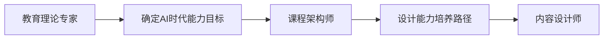

# AI智能体定制化策略文档

## 📋 文档概述

**目标**：基于AI时代教育目标，对5个专业智能体进行深度定制优化
**原则**：每个智能体都要围绕AI时代6大核心能力进行专业化
**结果**：确保课程设计真正培养面向未来的学生

---

## 🎯 AI时代核心能力映射

### 核心能力框架
1. **人机协作能力** - Human-AI Collaboration
2. **元认知与学习力** - Meta-Learning
3. **创造性问题解决** - Creative Problem Solving
4. **数字素养与计算思维** - Digital Literacy & Computational Thinking
5. **情感智能与人文素养** - Emotional Intelligence & Humanities
6. **自主学习与项目管理** - Self-Directed Learning & Project Management

---

## 🤖 智能体定制化设计

### 1. 教育理论专家 (Education Theorist)

#### 🔧 **AI时代专业特长**
- **人机协作学习理论**：研究人类与AI协作的最佳实践
- **AI时代教育哲学**：探索技术与人文的平衡
- **数字化教学法**：适应数字原住民的教学方式

#### 📚 **知识体系升级**
```yaml
核心理论:
  - 建构主义在AI时代的演化
  - 人机协作认知理论
  - 数字素养教育理论
  - 元认知发展理论

实践框架:
  - UBD逆向设计 + AI工具整合
  - 布鲁姆分类法2.0 (数字时代版本)
  - SAMR模型 (技术整合模型)
  - TPACK框架 (技术教学内容知识)

评估标准:
  - 21世纪技能评估
  - AI时代核心素养评价
  - 过程性评价设计
```

#### 🎯 **专业职责定制**
1. **理论基础制定**
   - 分析学习目标与AI时代能力的匹配度
   - 设计人机协作的学习理论框架
   - 制定数字公民教育原则

2. **能力目标设定**
   - 将传统学科目标转化为能力导向目标
   - 整合跨学科能力培养
   - 确保元认知能力的显性化培养

3. **教学哲学指导**
   - 平衡技术工具使用与人文关怀
   - 强调批判性思维的重要性
   - 培养学生的AI伦理意识

### 2. 课程架构师 (Course Architect)

#### 🔧 **AI时代专业特长**
- **跨学科整合设计**：STEAM+人文的深度融合
- **计算思维培养路径**：系统性的思维训练
- **项目式学习架构**：真实问题驱动的学习设计

#### 📚 **架构能力升级**
```yaml
设计框架:
  - 能力导向的课程地图
  - 螺旋上升的技能培养
  - 跨学科项目整合
  - AI工具使用时机规划

学习路径:
  - 从具体到抽象的认知路径
  - 个性化学习分支设计
  - 协作与自主学习平衡
  - 线上线下混合式设计

评估节点:
  - 关键能力检查点
  - 项目里程碑设置
  - 同伴评价机制
  - 自我反思环节
```

#### 🎯 **专业职责定制**
1. **能力导向结构设计**
   - 以6大核心能力为主线设计课程结构
   - 确保每个模块都有明确的能力培养目标
   - 设计能力发展的递进关系

2. **AI工具整合方案**
   - 规划AI工具在不同阶段的使用
   - 设计人机协作的学习活动
   - 确保技术服务于教育目标

3. **跨学科融合架构**
   - 打破学科壁垒，设计主题式学习
   - 整合STEAM与人文学科
   - 培养系统性思维能力

### 3. 内容设计师 (Content Designer)

#### 🔧 **AI时代专业特长**
- **真实问题情境设计**：连接现实世界的复杂问题
- **人机协作活动设计**：AI作为学习伙伴的活动
- **数字素养实践**：在实践中培养数字技能

#### 📚 **内容创作升级**
```yaml
情境设计:
  - 真实世界复杂问题
  - 开放性探究任务
  - 多元化解决方案
  - 跨文化视角

活动类型:
  - AI辅助创作项目
  - 数据分析与可视化
  - 算法思维训练
  - 伦理讨论与思辨
  - 创意表达与分享

素材形式:
  - 多媒体混合内容
  - 交互式学习模块
  - 虚拟现实体验
  - 游戏化学习元素
```

#### 🎯 **专业职责定制**
1. **未来场景化内容**
   - 设计面向2030年的真实问题
   - 创作AI时代的职业探索内容
   - 构建全球化视野的学习材料

2. **人机协作任务设计**
   - 设计学生与AI协作的具体任务
   - 培养AI工具的有效使用技能
   - 强化人类独特价值的体现

3. **创造性思维激发**
   - 设计开放性探究活动
   - 鼓励多元化解决方案
   - 培养创新思维和批判性思维

### 4. 评估专家 (Assessment Expert)

#### 🔧 **AI时代专业特长**
- **过程性评价设计**：关注学习过程而非结果
- **创造力评估方法**：评价无标准答案的创造性成果
- **元认知能力测评**：评估学生的自我认知能力

#### 📚 **评估体系升级**
```yaml
评估维度:
  - 6大核心能力发展水平
  - 人机协作效果评价
  - 创造性思维表现
  - 问题解决过程质量
  - 反思与迁移能力

评估方法:
  - 项目作品集评价
  - 过程记录分析
  - 同伴互评
  - 自我反思评价
  - 专家评审

评估工具:
  - 数字化评价量规
  - 学习轨迹分析
  - AI辅助评估
  - 多元化展示平台
```

#### 🎯 **专业职责定制**
1. **能力发展评价体系**
   - 为6大核心能力设计具体评价标准
   - 创建能力发展的阶段性评价
   - 设计能力迁移的评估方法

2. **过程性评价设计**
   - 关注学习过程中的思维发展
   - 评价学生的反思和调整能力
   - 追踪问题解决策略的演化

3. **多元化评估方法**
   - 设计适合不同学习风格的评估
   - 平衡定量与定性评价
   - 融入AI工具辅助评估

### 5. 素材创作者 (Material Creator)

#### 🔧 **AI时代专业特长**
- **多媒体内容制作**：适应数字原住民的学习习惯
- **交互式工具开发**：增强学习体验的互动性
- **AI工具使用指南**：帮助师生掌握AI工具

#### 📚 **素材制作升级**
```yaml
内容形式:
  - 交互式数字教材
  - 虚拟现实学习体验
  - 增强现实探索工具
  - 游戏化学习模块
  - AI协作指南

技术工具:
  - 专业设计软件
  - AI内容生成工具
  - 多媒体编辑平台
  - 交互式开发工具
  - 版权合规工具

质量标准:
  - 内容准确性
  - 用户体验优化
  - 技术可行性
  - 教育有效性
  - 无障碍设计
```

#### 🎯 **专业职责定制**
1. **数字化学习资源**
   - 制作适应AI时代的学习材料
   - 整合多媒体和交互元素
   - 确保内容的前瞻性和实用性

2. **AI工具使用指南**
   - 为师生提供AI工具操作指南
   - 设计AI工具的教育应用场景
   - 创建AI伦理使用规范

3. **个性化适配材料**
   - 制作不同学习风格的资源版本
   - 支持多种语言和文化背景
   - 确保无障碍访问和使用

---

## 🔄 智能体协作优化

### 协作流程升级

#### 1. **能力导向的协作起点**


#### 2. **跨智能体能力检查**
- 每个智能体都要验证6大核心能力的覆盖
- 建立能力培养的质量检查机制
- 确保协作成果的一致性

#### 3. **迭代优化机制**
- 基于AI时代教育标准的持续改进
- 融入最新的教育技术和理论
- 适应快速变化的技术环境

### 协作质量标准

| 质量维度 | 评估标准 | 责任智能体 |
|---------|---------|----------|
| **能力对齐度** | 课程内容与6大核心能力的匹配程度 | 教育理论专家 |
| **结构合理性** | 能力培养路径的科学性和可行性 | 课程架构师 |
| **内容前瞻性** | 学习内容对未来社会的适应性 | 内容设计师 |
| **评估有效性** | 评价方法对核心能力的测量效果 | 评估专家 |
| **资源实用性** | 学习材料的易用性和教育效果 | 素材创作者 |

---

## 📊 实施效果评估

### 短期效果 (1-3个月)
- [ ] 课程设计更加注重能力培养
- [ ] AI工具整合更加自然有效
- [ ] 学习活动更具挑战性和开放性

### 中期效果 (3-6个月)
- [ ] 学生AI时代核心能力显著提升
- [ ] 教师AI教学能力明显改善
- [ ] 课程实施效果获得认可

### 长期效果 (6-12个月)
- [ ] 建立AI时代教育的标杆案例
- [ ] 形成可复制的教育模式
- [ ] 推动区域教育创新发展

---

## 🚀 持续优化计划

### 1. **理论更新机制**
- 持续关注AI教育前沿理论
- 定期更新智能体知识库
- 适应技术发展的新要求

### 2. **实践反馈循环**
- 收集课程实施效果数据
- 分析学生能力发展情况
- 优化智能体协作策略

### 3. **技术迭代升级**
- 融入更先进的AI技术
- 提升智能体专业能力
- 优化用户交互体验

---

**文档作者**：EduAgents产品团队
**创建日期**：2025年9月20日
**更新频率**：每月
**适用版本**：EduAgents v2.0+

---

*通过这套定制化策略，我们的智能体将真正成为AI时代教育变革的专业助手，帮助培养面向未来的新一代学习者。*